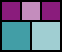
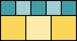

# Tiling Integer Rectangles with Integer Squares

Code for paper "When Can You Tile an Integer Rectangle with Integer Squares?"
by MIT CompGeom Group, Zachary Abel, Hugo A. Akitaya, Erik D. Demaine,
Adam C. Hesterberg, and Jayson Lynch

This software solves via brute force the problem of completely filling (tiling)
a rectangular board of given dimensions using nonoverlapping squares of
specified allowed sizes.

## Tilings

Here are the tilings found by the search up to 19×19
(drawn as SVGs by the code),
restricted to sizes where the numbers of rows and columns have a common divisor
*d*&nbsp;&gt;&nbsp;1; otherwise, it is easy to tile using *d*×*d* squares.

### 5×n

### 6×n

### 7×n

### 8×n

### 9×n

### 10×n

### 11×n

### 12×n

### 13×n

### 14×n

### 15×n

### 16×n

### 17×n

### 18×n

